# The Great TikZlings Christmas Extravaganza 2025

This repository contains the souce code of the Great TikZlings Extravanganza 2025, brought to you by [Ulrike](https://github.com/u-fischer) & [Gert Fischer](https://github.com/g-fischer), [Carla Maggi](https://github.com/CarLaTeX), [Max Chernoff](https://github.com/gucci-on-fleek), [Paulo Cereda](https://github.com/cereda) and [samcarter](https://github.com/samcarter).

The full video is available from ...

[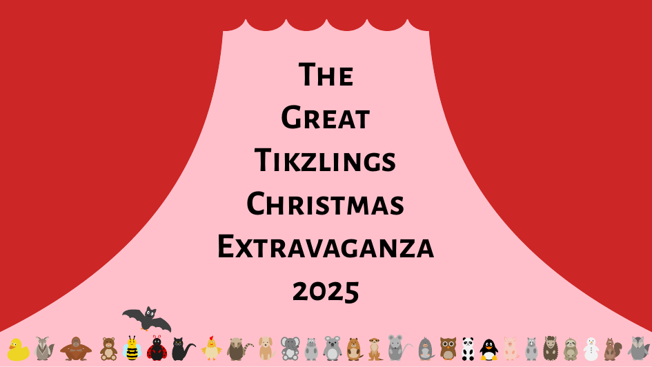](...)

## Calendar

To shorten the waiting time until the next Extravaganza, we created the exclusive "The Great TikZlings Calendar 2026". It has all important dates from the TeX-World and the Tikzling universe. Stay up to date!

<a href="https://raw.githubusercontent.com/TikZlings/Extravaganza2025/main/calendar/extravaganza_calendar.pdf">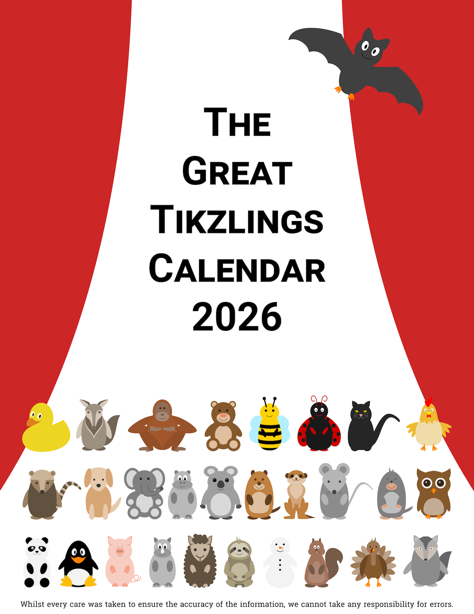</a>

(The design was modified from LianTze Lim's fantastic calendar template  https://tex.my/category/calendar/ which made creating this calendar really easy.)

## Prologue

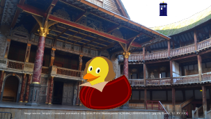

- Sound: "As You Like It" by William Shakespeare,
  Read by Benedict Cumberbatch,
  0:00-???,
  https://www.youtube.com/watch?v=0178jo7Mka0
  
- Image: https://commons.wikimedia.org/wiki/File:Shakespeare's_Globe_(39593782581).jpg
  
- Source Code: [./samcarter/globe/](https://github.com/TikZlings/Extravaganza2025/tree/main/samcarter/globe/)

## Silent Beach

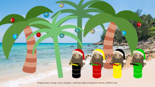

- Music: Silent Night,
  Myer Levin Advanced Steel Band,
  0:08-0.28,
  https://www.youtube.com/watch?v=IaeVqF05nTg
  
- Image: www.freepik.com
  
- Source Code: [./ulrike/silentnight/](https://github.com/TikZlings/Extravaganza2025/tree/main/ulrike/silentnight/)

## A Nature Lover

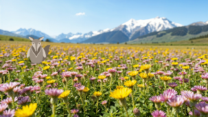

- Music: Where Have All The Flowers Gone,
  Pete Seeger,
  0:08-0:26,
  https://www.youtube.com/watch?v=JANHG_OYbso
  
- Image: https://www.freepik.com/free-ai-image/beautiful-spring-landscape-with-blooming-flowers_403402532.htm
  
- Source Code: [./paulo/flower-field/](https://github.com/TikZlings/Extravaganza2025/tree/main/paulo/flower-field/)

## Stormy Weather

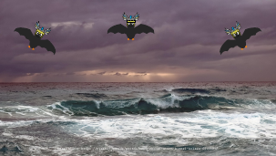

- Music: Walkürenritt,
  Richard Wagner,
  0:23 - 0:43,
  https://www.youtube.com/watch?v=p_MDQzyVFew
  
- Image: https://pixabay.com/de/photos/meer-wellen-sturm-himmel-wolken-6975501/
  
- Source Code: [./carlatex/StormyWeather/](https://github.com/TikZlings/Extravaganza2025/tree/main/carlatex/StormyWeather/)

## Lumberjack

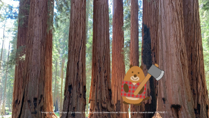

- Music: Lumberjack Song,
  Monty Python,
  0:24 - 0:43,
  https://www.youtube.com/watch?v=FshU58nI0Ts
  
- Image: https://pixabay.com/de/photos/mammutbaum-bäume-stämme-baumstämme-5978487/
  
- Source Code: [./carlatex/Lumberjack/](https://github.com/TikZlings/Extravaganza2025/tree/main/carlatex/Lumberjack/)

## Commercial Break

- Music: O Canada - Canadian National Anthem ,
  Beautiful Choir with Piano,
  0:20-0:40,
  https://www.youtube.com/watch?v=XfBLfHV8sdQ
  
- Image: https://pixabay.com/de/photos/kanada-tag-calgary-alberta-kanada-5370627/
  
- Source Code: [./max/commercial/](https://github.com/TikZlings/Extravaganza2025/tree/main/max/commercial/)

## A Mirage

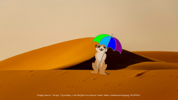

- Music: Singin' in the Rain,
  Gene Kelly,
  0:22-0:40,
  https://www.youtube.com/watch?v=gAI6hhsDNxc
  
- Image: https://pixabay.com/de/photos/wüste-sand-düne-sonnenuntergang-9019840
  
- Source Code: [./carlatex/mirage/](https://github.com/TikZlings/Extravaganza2025/tree/main/carlatex/mirage/)

## Happy Christmas

- Music: Baby Elephant Walk,
  Henry Mancini & His Orchestra,
  0:18 - 0:40,
  https://www.youtube.com/watch?v=EbI2nl3Duf8

- Source Code: [./carlatex/HappyChristmas/](https://github.com/TikZlings/Extravaganza2025/tree/main/carlatex/HappyChristmas/)

## Sweet dreams are made of cheese

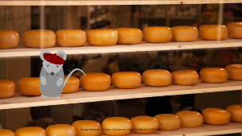

- Music: Sweet dreams (Are made of this),
  Eurythmics,
  0:50-1:10,
  https://www.youtube.com/watch?v=IRr_CfNbBpA
  
- Image: https://pxhere.com/en/photo/1257616
  
- Source Code: [./samcarter/cheese/](https://github.com/TikZlings/Extravaganza2025/tree/main/samcarter/cheese/)

## En vacançes

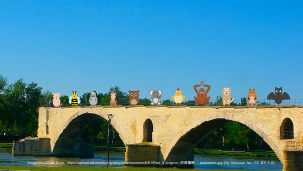

- Music: Sur le pont d'Avignon,
  adapted by Adolphe Adam,
  0:05-...,
  https://www.youtube.com/watch?v=uJKfxtYAt0s
  
- Image: https://commons.wikimedia.org/wiki/File:Pont_d`Avignon_阿微儂橋_-_panoramio.jpg
  
- Source Code: [./samcarter/Avignon/](https://github.com/TikZlings/Extravaganza2025/tree/main/samcarter/Avignon/)

## Commercial Break

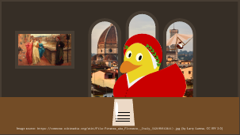

- Sound: Basse danse La Magdalena,
  Pierre Attaingnant,
  0:40-???,
  https://www.youtube.com/watch?v=UF1MwE7Knfs
  
- Image: https://commons.wikimedia.org/wiki/File:Firenze_aka_Florence,_Italy_(42195612411).jpg
  
- Source Code: [./samcarter/dante/](https://github.com/TikZlings/Extravaganza2025/tree/main/samcarter/dante/)

## Dinner

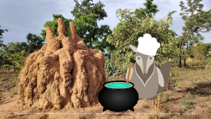

- Music: My Way,
  Frank Sinatra,
  1:45-2:10,
  https://www.youtube.com/watch?v=qQzdAsjWGPg
  
- Image: https://commons.wikimedia.org/wiki/File:L'habitat_des_fourmis_au_parc_national_de_la_bénoué_au_Cameroun_23.jpg
  
- Source Code: [./samcarter/dinner/](https://github.com/TikZlings/Extravaganza2025/tree/main/samcarter/dinner/)

## TikZlings Abbey

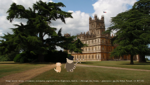

- Music: Downton Abbey (Main Theme),
  John Lunn,
  0:00-???,
  https://www.youtube.com/watch?v=j3_E9qVmrV0
  
- Image: https://commons.wikimedia.org/wiki/File:Highclere_Castle_-_Through_the_Trees_-_panoramio.jpg
  
- Source Code: [./samcarter/TikZlingsAbbey/](https://github.com/TikZlings/Extravaganza2025/tree/main/samcarter/TikZlingsAbbey/)

## Hockey

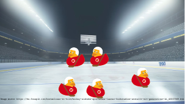

- Music: Schneewalzer,
  0:05 - 0:025,
  https://www.youtube.com/watch?v=r4ugf3FTCj4
  
- Source Code: [./ulrike/nhl/](https://github.com/TikZlings/Extravaganza2025/tree/main/ulrike/nhl/)

## Birds

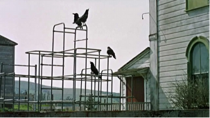

- Music: The Birds children singing,
  1:17 - ??,
  https://www.youtube.com/watch?v=JOGC3sNJJxs
  
- Source Code: [./ulrike/birds/](https://github.com/TikZlings/Extravaganza2025/tree/main/ulrike/birds/)

## Grand Finale

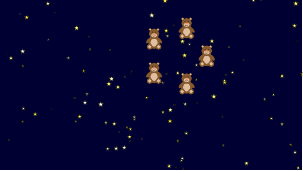

- Music: Song of Joy,
  Miguel Rios,
  0:45 - 1:05,
  https://www.youtube.com/watch?v=D2MqD3FEjcs
  
- Source Code: [./ulrike/finale/](https://github.com/TikZlings/Extravaganza2025/tree/main/ulrike/finale/)
